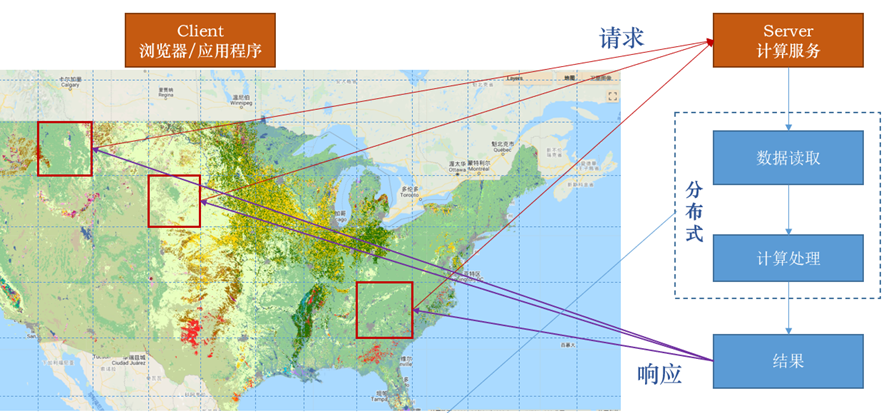
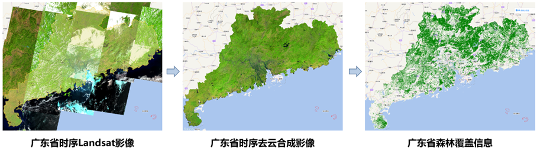
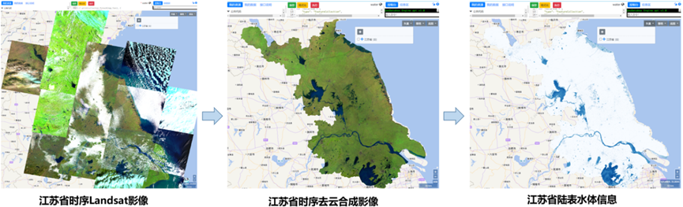
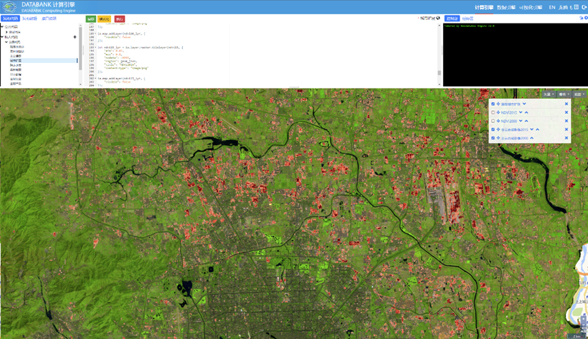
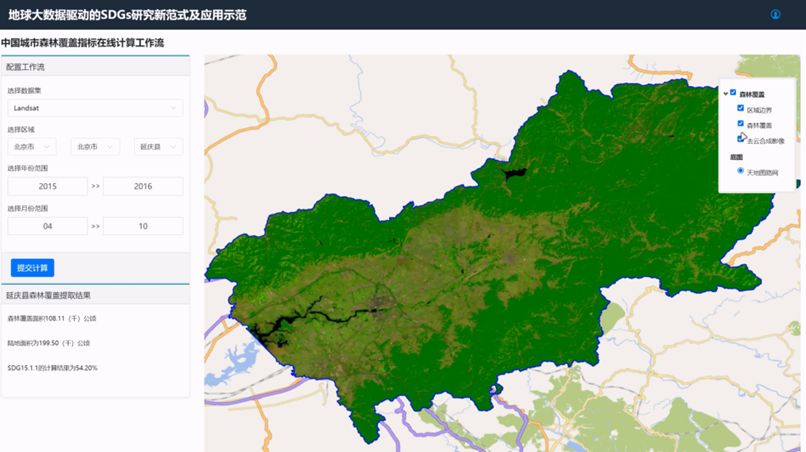

### 总体完成情况
建成了CASEarth DataBank系统，实现了数据、计算和服务的一体化；建成了多源遥感卫星数据整合加工服务系统，实现了18种多源遥感卫星数据产品的按需整合加工；建成了多源卫星数据/产品质量检验系统，支持22种国内外对地观测卫星数据/产品的质量检验。
建成了中国及周边区域1980s以来全时序Landsat系列卫星 RTU产品集，包括地表反射率、地表温度、星上反射率、星上亮温、NDVI、EVI、MSAVI、SAVI、NDWI、NDMI、NBR、FVC共计12种产品，总体平均64.5万景、774万个数据产品。完成了14期30米分辨率全球一张图的生产，时间为：1980s、1985s、1990s、1995s、2000s、2005s、2010s、2011s、2013s、2015s、2017s、2018s、2019s、2021s。完成了6期2米分辨率全国一张图的生产，时间为：2016s、2018s、2019s、2020s、2021s、2022s。按专项内外需求提供局部重点区域最高至亚米级分辨率的数据产品集。根据院科学数据管理措施要求及专项数据共享工作统一部署，已完成课题的数据汇交任务，总数据量约2.9PB。

### CASEarth Databank系统平台

### 建成了长时序多源对地观测RTU产品集

#### （1）中国及周边区域全时序Landsat系列卫星RTU产品集

中国及周边区域全时序Landsat系列卫星RTU产品集在科研机构、高校和行业应用部门等30余家单位得到应用，如中科院青藏所、中科院植物研究所、中科院地理所、中科院新疆生地所、中科院生态中心、中科院山地所、清华大学、北京大学、复旦大学、武汉大学、深圳大学、中国地质大学、法国国立高等建筑学院（ENSAS）、中国林业科学研究院资源信息研究所、阳光新能源股份有限公司等，涉及农业、林业、国土、生态环境、能源等多个行业领域。

#### （2）多源高分辨率RTU产品集

2米分辨率全国一张图服务于数字地球科学平台系统展示。重点区域最高至亚米分辨率产品已服务于系统平台展示、海南SDGs示范区、临沧SDGs示范区等相关工作。

#### （3）全球尺度30米分辨率专题信息产品

30米分辨率全球陆表水体产品已纳入到可持续发展大数据国际研究中心的“全球水资源数据产品”体系中，并于2023年3月向国际社会公开发布，为全球和区域范围内与水相关的可持续发展目标（如SDG 6.6、SDG 11、SDG 13、SDG 15等）的监测和评估提供数据信息支持，促进全球水资源的科学发展和可持续利用。同时，针对不同用户需求，CASEarth DataBank系统可提供该产品的批量下载、在线可视化等多种数据服务方式，实现全球数据产品的便捷共享和应用。

森林覆盖产品研究成果连续入选郭华东院士主编的《2020地球大数据支撑可持续发展目标（SDGs）报告》和《2021地球大数据支撑可持续发展目标（SDGs）报告》（中英文）。森林产品入选“SDG公共数据产品”，研究案例参展可持续发展大数据国际论坛成果展并选为“SDG大数据平台”首页进行展示，在平台上实现了SDG15.1.1 森林覆盖数据产品按需生产和SDG15.1.1 森林覆盖率评估。

在服务国家科技外交方面，金砖国家可持续发展大数据论坛于2022年4月26日至27日在北京举行，“2020年全球30m森林覆盖空间分布产品”作为全球基础产品纳入“金砖国家可持续发展数据产品”，服务新华社《太空看“金砖”》新闻视频并作为核心产出对外发布。2022年10月，全球30m森林覆盖产品又入选CBAS赠送联合国全球可持续发展数据产品，并由中国国务委员兼外交部长王毅赠送联合国。

火烧迹地产品研究案例入选2020和2021年《地球大数据支撑可持续发展目标(SDGs)报告》（中英文），参展“地球大数据促进可持续发展目标监测和评估成果展”（为庆祝中华人民共和国恢复联合国合法席位50周年，由中科院主办，SDG中心等承办）。应外交部的需求，基于长时序30米分辨率火烧迹地产品，向外交部提交信息专报《澳大利亚高分辨率火烧迹地动态监测（2005-2019）》，为外交部进行相关决策提供了数据和信息支持。

火烧迹地产品在2022年9月20日召开的“全球发展倡议之友小组”部长级会议上，由国务委员兼外长王毅赠送给联合国，为各国更好实现可持续发展目标提供数据产品支持。火烧迹地产品也成功入选UN Biodiversity Lab（UNBL）数据共享平台。
