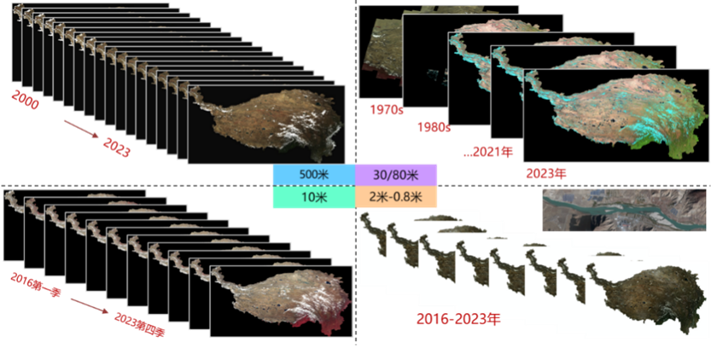
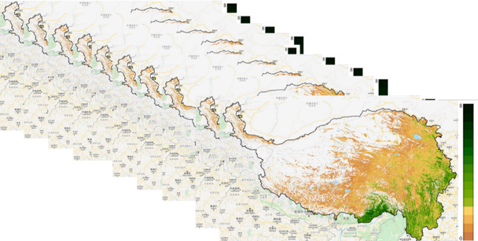
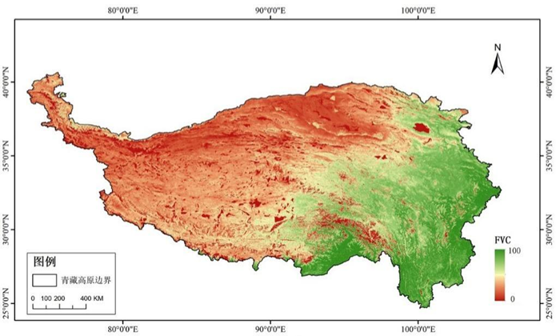
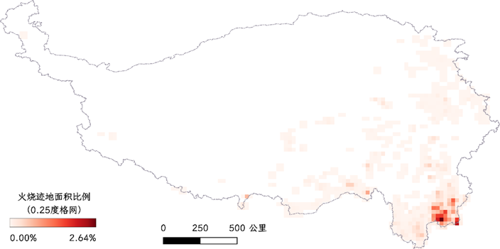
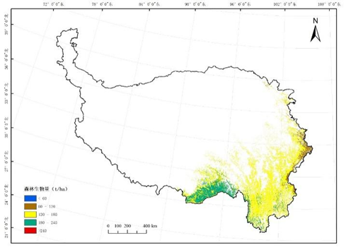
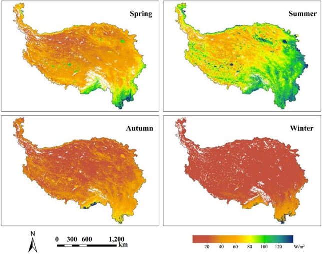
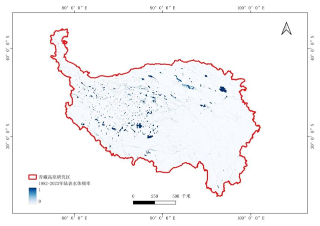
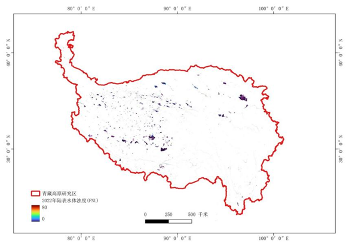
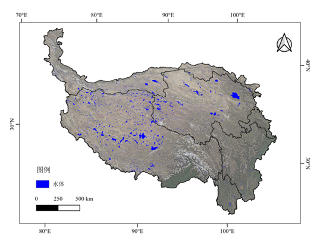

### 总体完成情况
基于多源卫星遥感数据、无人机遥感数据及野外科考数据，研发了长时序多尺度多源卫星遥感数据的几何标准化、辐射归一化处理技术以及天、空、地立体协同的生态系统关键参数遥感反演技术，建成了青藏高原地区长时序、多分辨率、高精度的卫星遥感数据RTU产品集以及5大类24种生态系统关键参数遥感反演产品集，包括青藏高原植被结构与生长状态参数、碳循环参数、陆表能量参数、水体参数与水体分布信息以及人类活动信息等生态系统关键参数遥感定量反演产品，空间分辨率从500m-0.8m，时间从1970s-2023年，为青藏高原生态系统服务现状评估和变化趋势分析提供可靠的数据产品保障。

### 青藏高原地区长时序多源遥感卫星RTU产品集（科考一张图）

### 长时序生态系统关键参数遥感反演产品集

