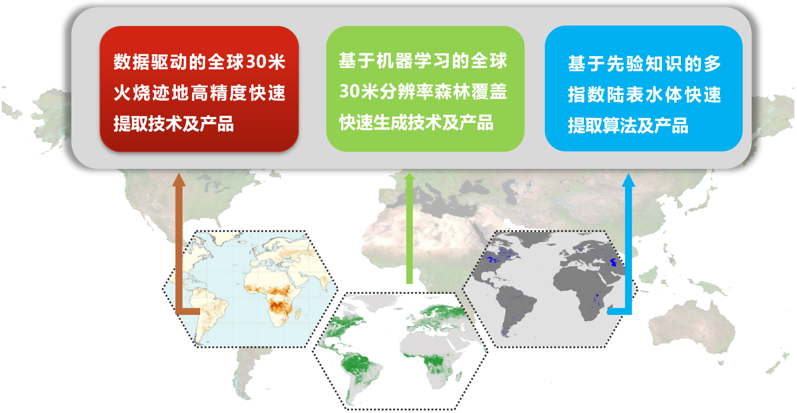
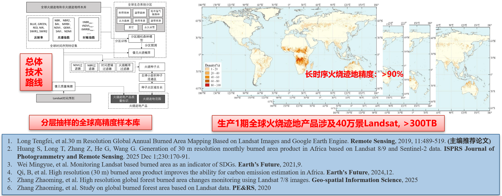
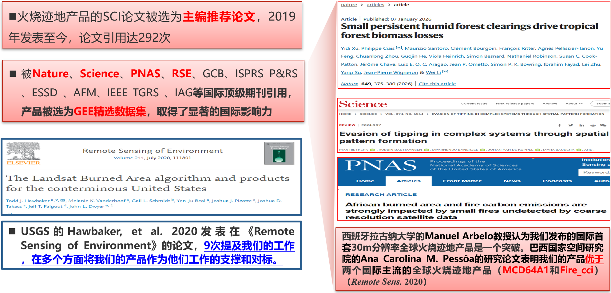
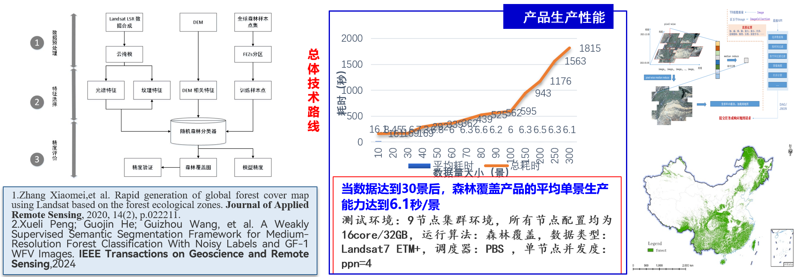
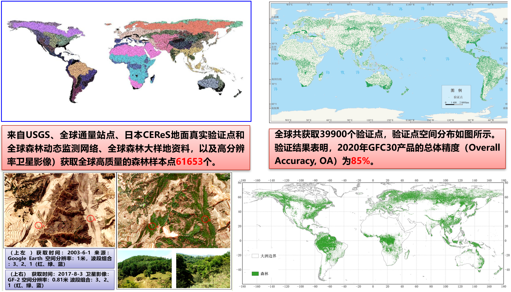
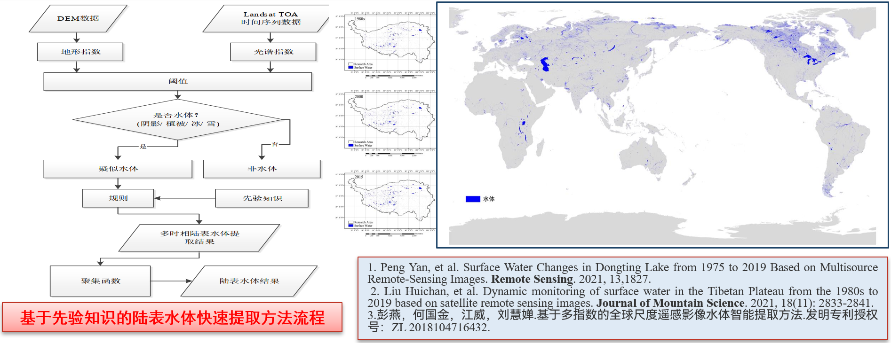
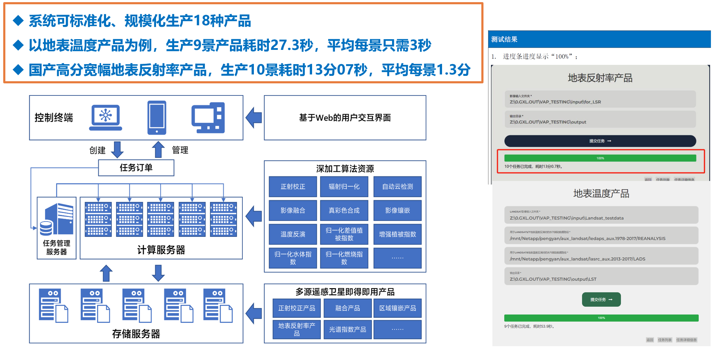
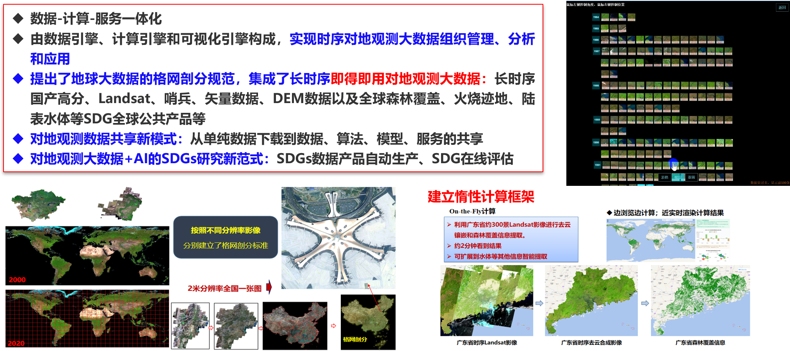
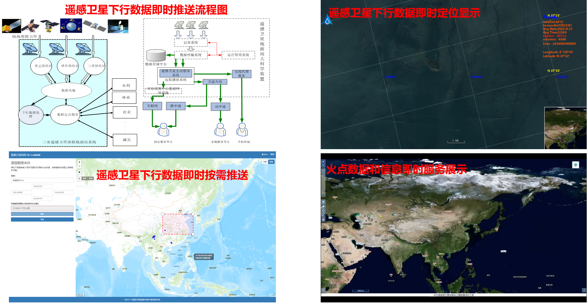



### 1. 大尺度全球遥感产品快速生成技术

#### （1）全球30米火烧迹地高精度快速生成技术及产品
原创性地提出了基于多源敏感参量和机器学习的全球30米火烧迹地高精度快速生成算法，研发了国际首套/唯一30米全球火烧迹地产品（1990-2024），该产品是目前空间分辨率最高的全球火烧迹地产品。在ISPRS P&RS、Earth’s Future等期刊发表论文11篇，论文被Nature、Science、PNAS等引用。产品支撑了Nature等论文成果，产品由外长王毅赠送联合国。

#### （2）基于机器学习的全球30米分辨率森林覆盖产品快速生成技术
提出了基于全球生态系统分区和众源样本数据、机器学习算法的全球30米分辨率森林覆盖产品快速处理技术，形成了全球森林产品的自动化、持续生产的能力，共享发布了目前时间跨度最长、时效性最高的30m分辨率全球森林覆盖产品。实现16米国产卫星中国森林制图。

#### （3）基于先验知识的陆表水体产品快速生成技术
研发了基于先验知识的陆表水体信息快速提取方法，通过使用多种指数排除干扰因素并运用先验知识进行水体提取，有效避免人工样本选取，提高自动化程度。同时，使用当年可获取的多时相数据参与计算，水体提取结果更具可靠性。总体精度为90.6%。

### 2. 多源遥感信息即得即用智能服务系统

#### （1）多源遥感卫星数据即得即用产品整合加工子系统

#### （2）CASEarth Databank智能服务子系统
依托大科学装置中国遥感卫星地面站，联合中国科学院计算机网络信息中心、中国科学院软件研究所、中国科学院计算技术研究所，一方面充分发挥中国遥感卫星地面站的数据获取优势与存档数据资源，并结合其它对地观测数据，通过整合加工和标准化处理，建立了长时序多源遥感卫星数据即得即用（Ready To Use，RTU）产品集，为地球大数据科学工程提供可靠、稳定、持续更新的多源遥感卫星数据产品，并分层次提供产品服务和共享；另一方面，研发了具有自主知识产权的CASEarth DataBank系统，建立数据、计算与服务一体化的长时序对地观测数据智能服务平台，引入通用人工智能算法及面向应用的领域算法，并基于惰性计算框架实现海量地球大数据的云端近实时处理，从而解决了对地观测数据下载困难、数据处理专业性强、分析效率低下等问题，支撑了一系列可持续发展目标（SDGs）研究案例，并建立了地球大数据驱动的SDGs研究新范式。DataBank平台集成多学科优势，形成数据、计算与服务的完整链条，创新了大数据时代卫星遥感数据和信息服务模式，为研究者提供强大而方便的科学实验平台，有助于地球大数据向空间信息和地学知识高效转化，促进人工智能与遥感信息处理等多学科交叉融合、知识发现和科技创新。

#### （3）多卫星下行数据即时服务子系统

