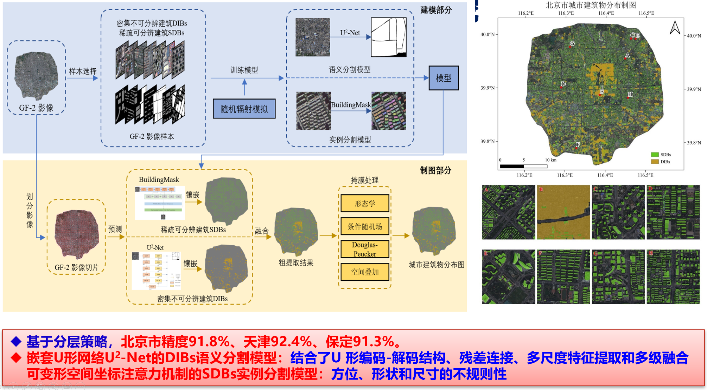
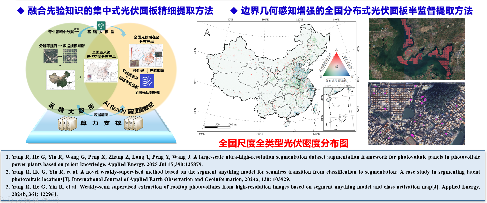
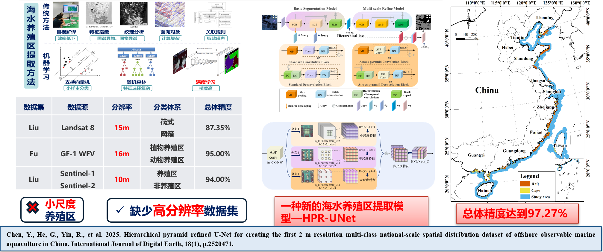
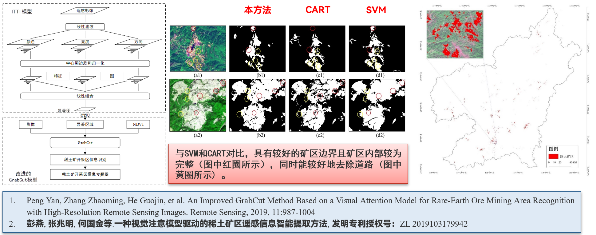
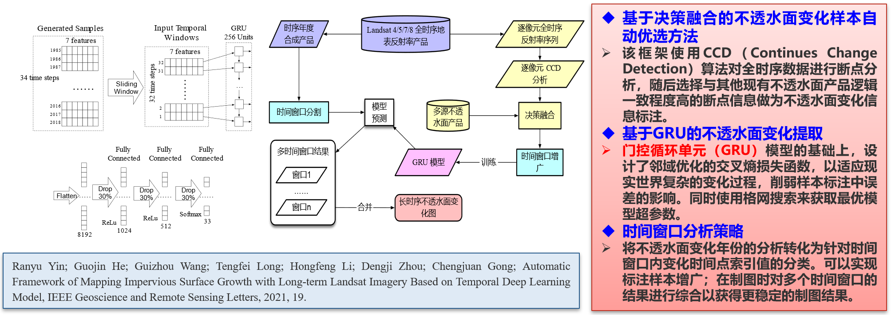
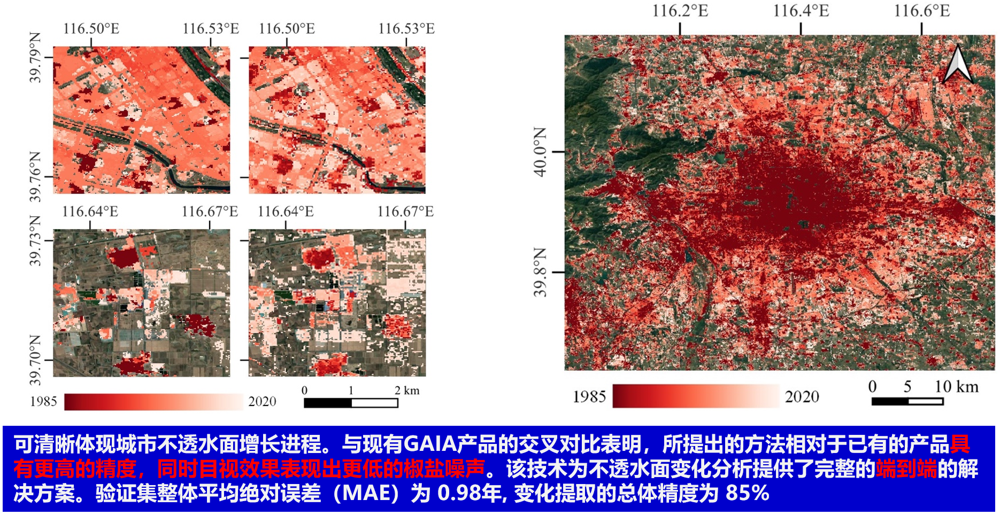
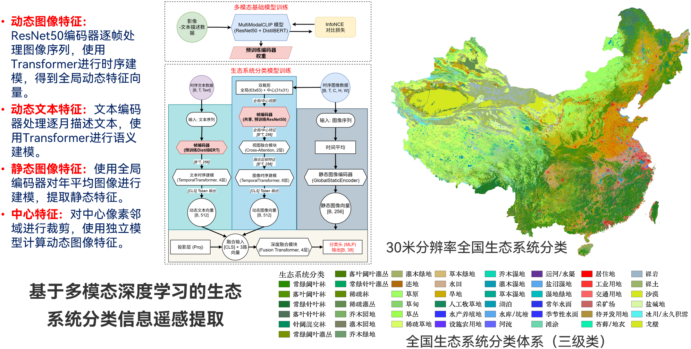



地学知识和遥感数据并不是孤立的，遥感数据智能需要充分利用数据之间存在的关联，为遥感数据分析任务提供更丰富的信息和视角；需结合地学过程机理，建立地学知识约束的高分遥感图像目标协同认知计算模型，才能提高海量遥感数据的目标认知精度与效率。

### 1. 地学知识约束的高分遥感图像目标协同认知计算技术

#### （1）城市建筑物分层深度学习技术，实现大区域城市建筑物提取

#### （2）大尺度超高分辨率全类型光伏深度学习提取框架，首次实现中国全国尺度0.3米分辨率遥感影像集中式和分布式光伏分布的精细提取

#### （3）层级金字塔优化网络语义分割模型（HPR-UNet），实现了首个2米分辨率全国尺度多类型海洋牧场产品（筏式养殖、网箱养殖、深水圆形网箱）

#### （4）基于植被指数约束的稀土矿开采区高分遥感图像认知技术，实现稀土矿开采区信息快速高精度提取

### 2. 长时序大尺度的遥感动态信息挖掘与异常信息发现技术
基于时序深度学习模型的长时序不透水面动态信息自动挖掘方法

### 3. 遥感大数据和AI支持的生态系统分类及更新技术
